# Call AI - Raycast Extension

Raycast 上で複数の AI プロバイダーを使えるチャット拡張機能。

## プロバイダー

| プロバイダー        | 説明                                 | 認証方式                            | 追加課金              |
| ------------------- | ------------------------------------ | ----------------------------------- | --------------------- |
| **OpenAI API**      | OpenAI Responses API 直接呼び出し    | API キー（Preferences）             | API 従量課金          |
| **Codex CLI**       | OpenAI Codex CLI (`codex exec`) 経由 | ChatGPT アカウント（`codex login`） | Pro/Plus プラン範囲内 |
| **Claude Code CLI** | Claude Code CLI (`claude -p`) 経由   | Claude サブスク（`setup-token`）    | Pro/Max プラン範囲内  |

## セットアップ

リポジトリをクローン（または ZIP ダウンロード）し、依存パッケージをインストールします。

```bash
git clone <this-repo>
cd raycast-call-ai
npm install
npm run dev
```

`npm run dev` を実行すると拡張機能がビルドされ、Raycast に開発モードで読み込まれます。Raycast 上で「Call AI」が使えるようになっていることを確認してください。

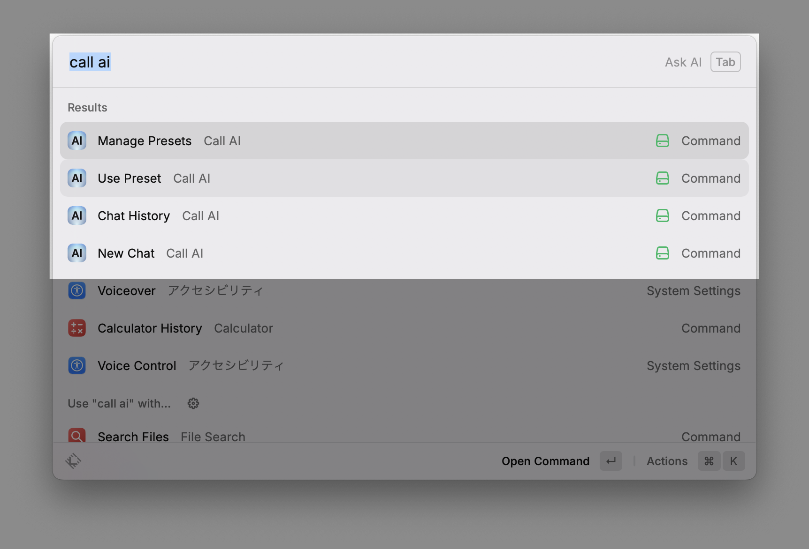

> **Note:** `npm run dev` はファイル変更を監視し続けるため、ターミナルのプロセスが動作中の間のみ拡張機能が有効になります。常用する場合は `npm run build` でビルドしておくと、プロセスを起動し続ける必要がなくなります。

## 使い方

### プロンプトと使用モデルの設定を行う

**Manage Presets** コマンドから、使用したい AI プロバイダー・モデル・システムプロンプトの組み合わせをプリセットとして登録できます。

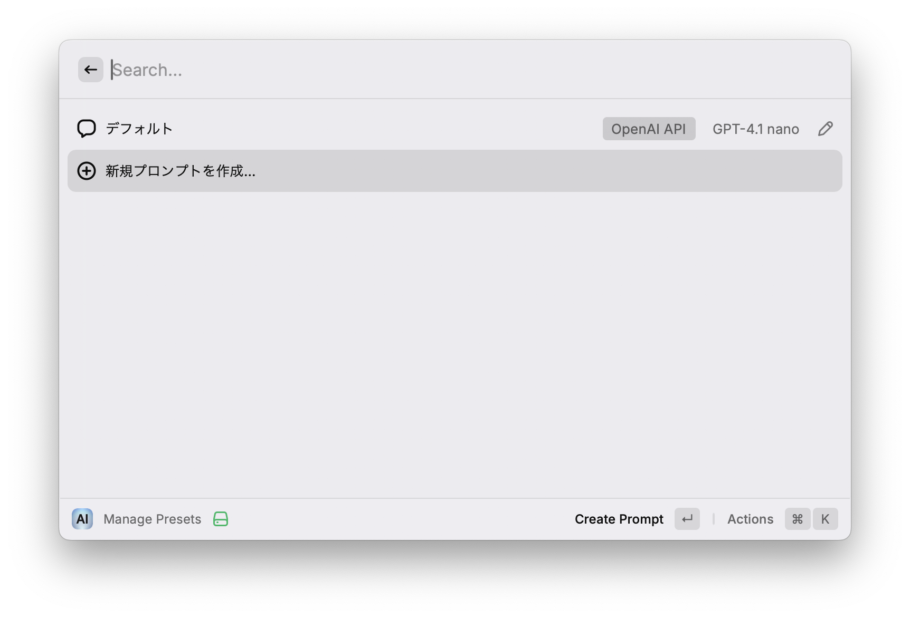

初期状態では「デフォルト」プリセットが 1 つだけ用意されています。

#### デフォルトプリセットの設定

編集フォームを開くと、以下のような画面になります。プロバイダー・モデル・システムプロンプトなどを自由にカスタマイズしてください。

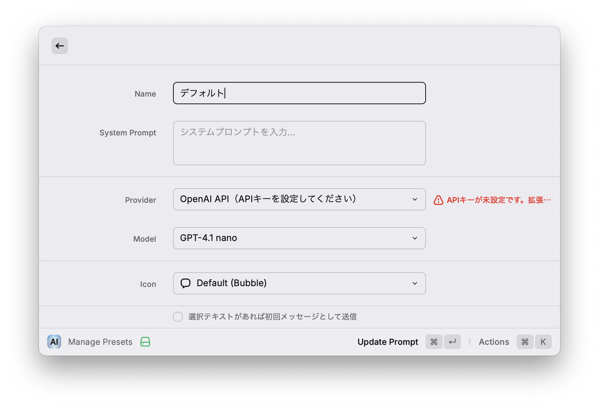

#### API キーの設定

OpenAI API を使用する場合は、Raycast の拡張機能設定画面から **OpenAI API Key** を入力しておく必要があります。

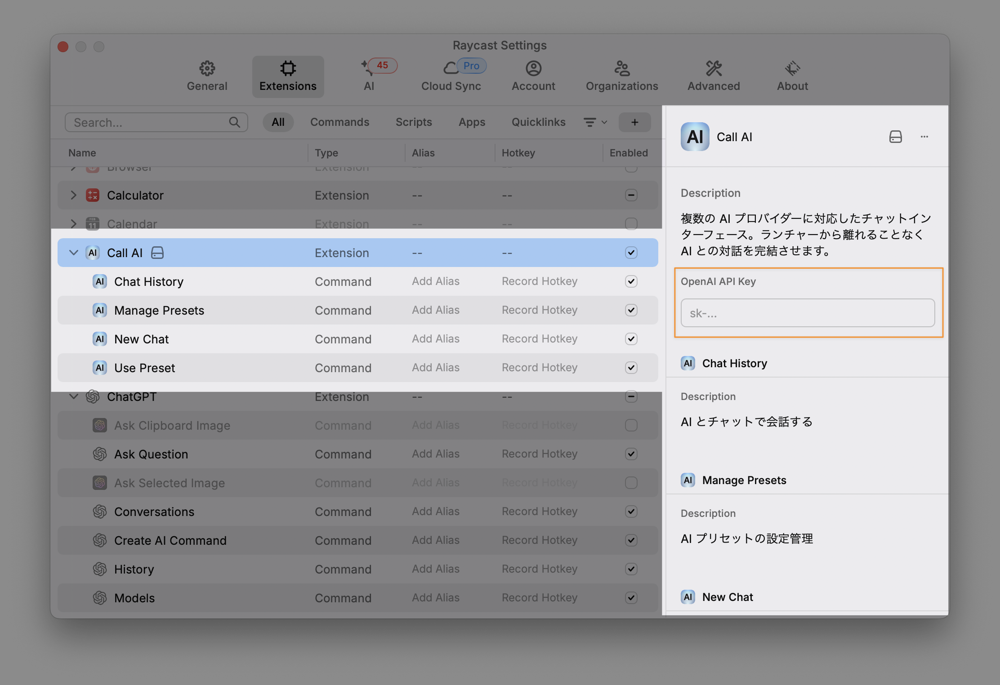

拡張機能の設定画面は、コマンド画面の左下から遷移できます。

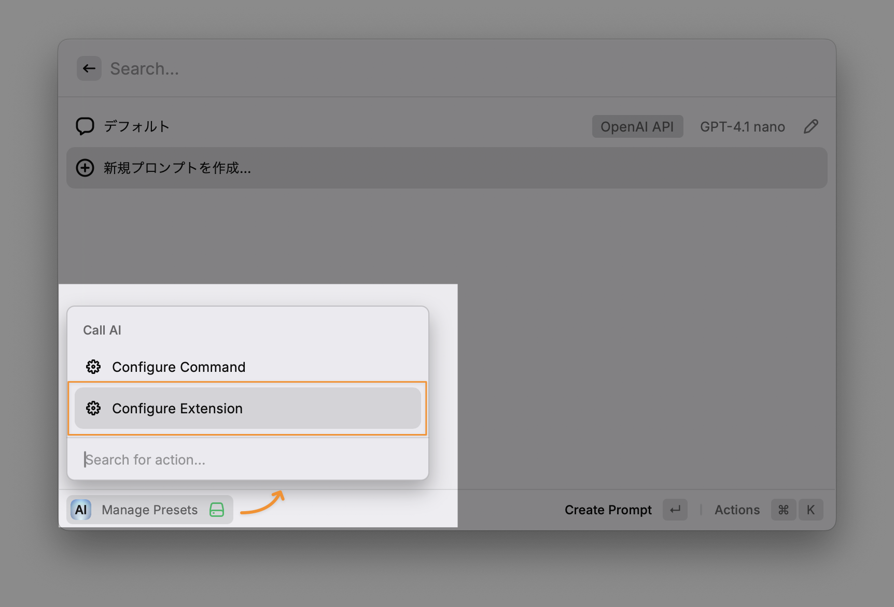

#### CLI を使う場合

Codex CLI や Claude Code CLI を使用する場合は、あらかじめ CLI をインストールしておく必要があります。

- **Codex CLI**: [公式手順](https://github.com/openai/codex)に従ってインストールし、`codex login` で認証
- **Claude Code CLI**: [公式手順](https://docs.anthropic.com/en/docs/claude-code)に従ってインストールし、`claude setup-token` で長期トークンを設定（Claude Pro/Max プランが必要）

> **CLI 利用時の注意:**
>
> - CLI 経由で呼び出す場合、`~/.claude/CLAUDE.md` などの設定ファイルが自動的に読み込まれます。プリセットのシステムプロンプトと内容が重複しないようご注意ください。
> - Web 検索の利用可否は CLI 側の設定に依存します。Codex CLI ではデフォルトで有効ですが、Claude Code CLI では `.claude/settings.json` のパーミッション設定で明示的に許可する必要があります。

### 会話を始める

**New Chat** コマンドで、新しいチャットスレッドを作成できます。デフォルトプリセットの設定が適用されます。


### プリセットの呼び出し

登録したプリセットは、**Use Preset** コマンドから呼び出すか、チャット画面右上のドロップダウンで切り替えて使用できます。

**Use Preset** コマンドを開くと、プリセット一覧が表示されます。

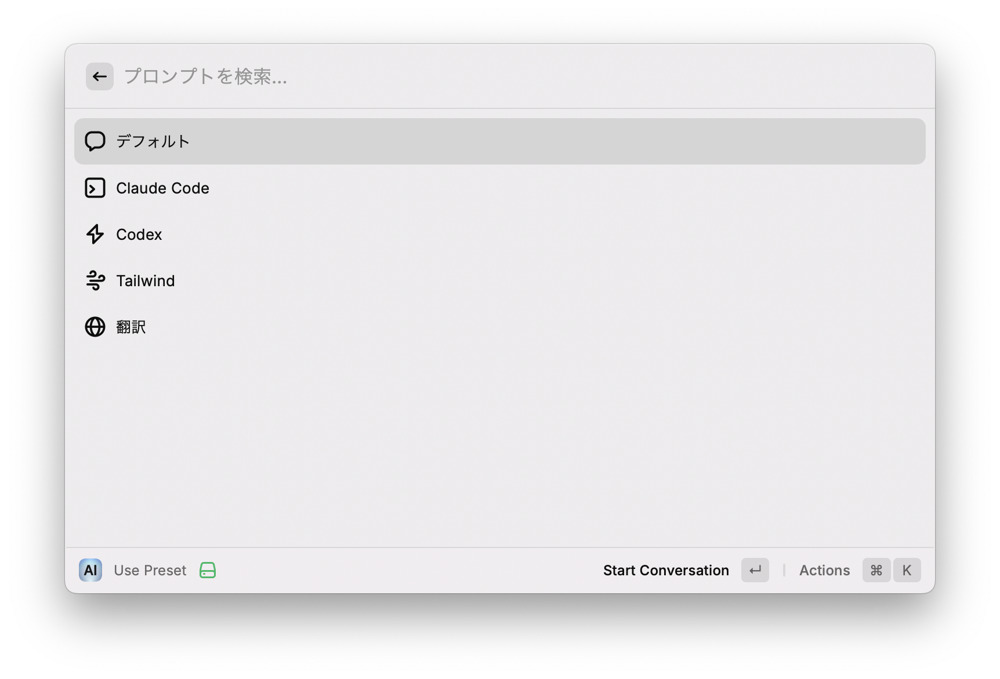

チャット画面からもドロップダウンでプリセットを選択できます。

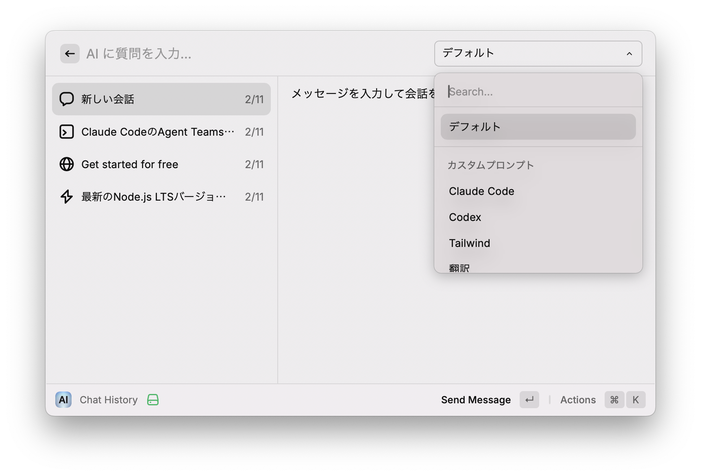

また、**Use Preset** コマンドにプリセット名を引数として渡すことで、一覧画面を経由せず直接呼び出すことも可能です。

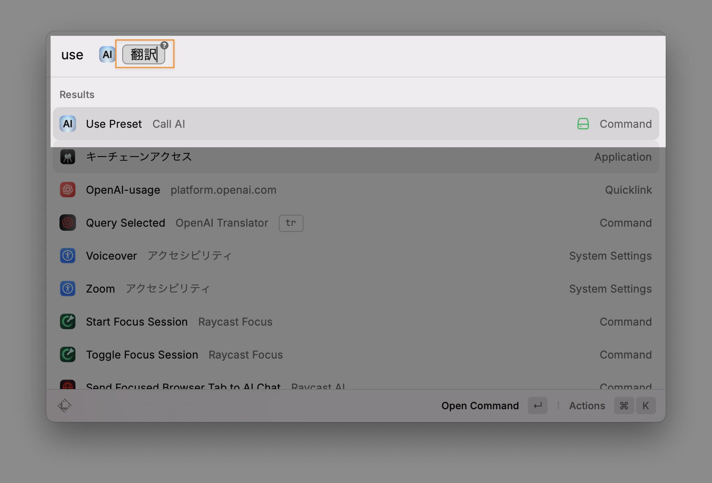

#### プリセットを独立コマンドとして使用する（Quicklink）

よく使うプリセットは、Raycast の **Quicklink** に登録することで独立したコマンドのように呼び出せるようになります。

**Use Preset** のプリセット一覧画面、または **Manage Presets** のプリセット編集画面で **Create Quicklink** アクション（`⌘⇧L`）を実行してください。

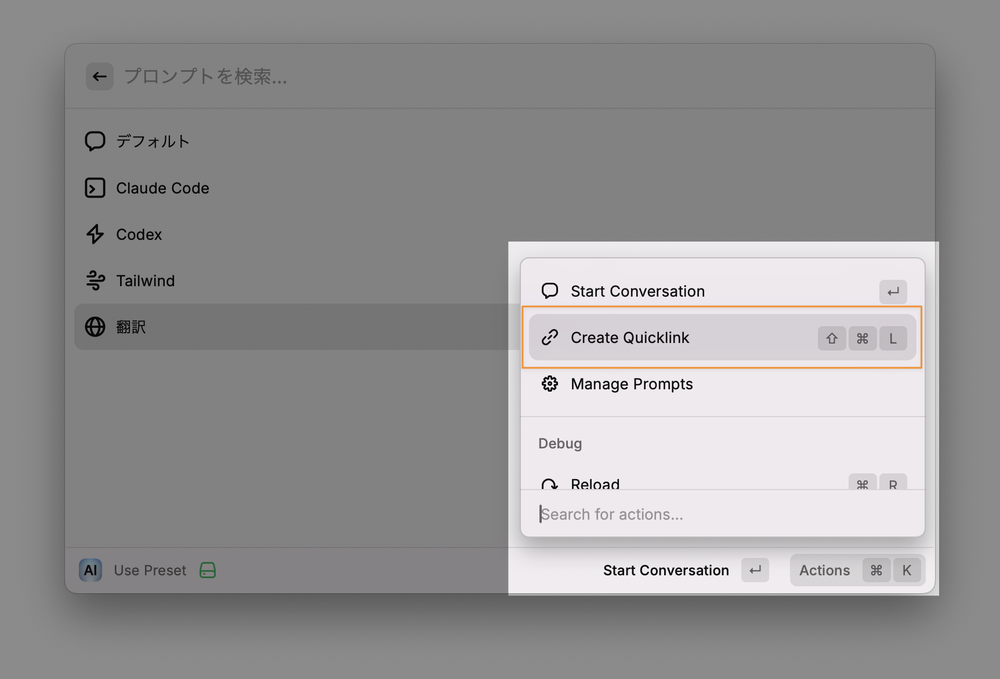

Quicklink の作成フォームが表示されるので、そのまま **Save** します。

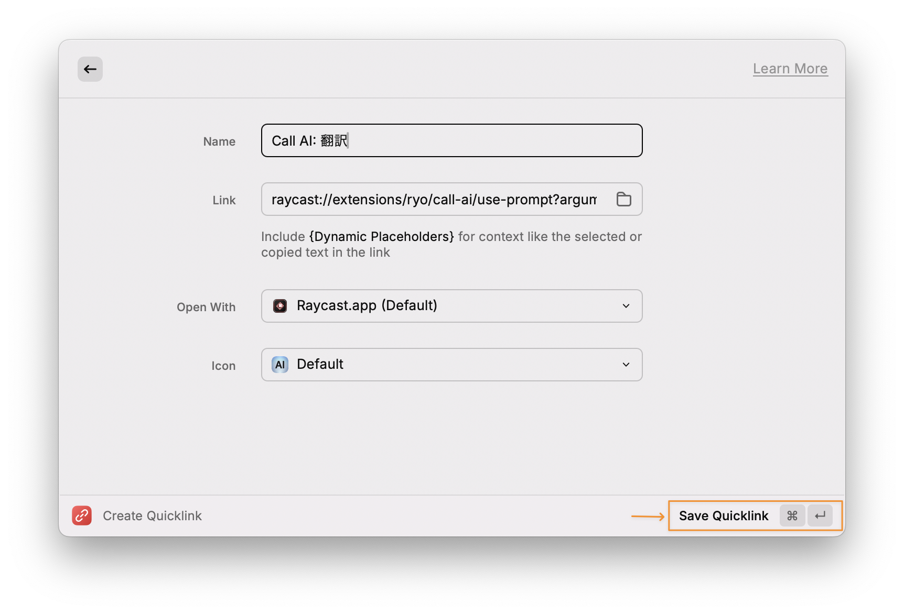

保存すると、Raycast のコマンド検索からプリセットを直接呼び出せるようになります。

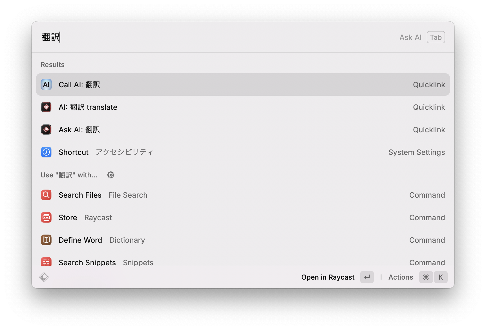

初回呼び出し時のみ確認ダイアログが表示されますが、**Always Allow** を選択すれば以降は表示されなくなります。

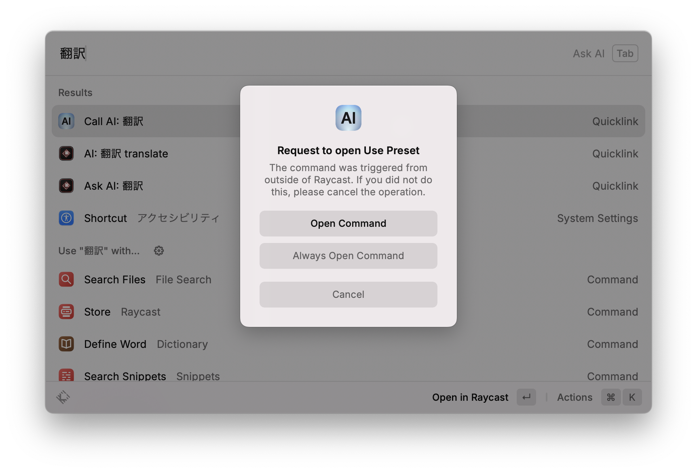

> **注意:**
>
> - プリセットを削除しても、作成済みの Quicklink は自動では削除されません。不要になった場合は手動で削除してください。
> - プリセットのタイトルを変更した場合も、Quicklink の再作成が必要です。

## コマンド一覧

| コマンド           | 説明                                                           |
| ------------------ | -------------------------------------------------------------- |
| **Chat History**   | 会話履歴を表示し、既存スレッドで AI とチャット                 |
| **New Chat**       | 新しいスレッドを作成して AI とチャットを開始                   |
| **Use Preset**     | プリセットを選んで会話を開始（引数でプリセット名を直接指定可） |
| **Manage Presets** | プリセットの作成・編集・削除・並べ替え                         |

## アクション（ショートカットキー）

### Chat History / New Chat

| アクション               | ショートカット | 説明                                                         |
| ------------------------ | -------------- | ------------------------------------------------------------ |
| Send Message             | `↵`            | 入力テキストを AI に送信                                     |
| Copy Last Response       | `⌘⇧C`          | 最後の AI 応答をクリップボードにコピー（応答がある場合のみ） |
| Multiline Input          | `⌘L`           | 複数行入力フォームを開く                                     |
| New Conversation         | `⌘N`           | 新規スレッドを作成                                           |
| Clear Conversation       | `⌘⇧⌫`          | 現在のスレッドの会話をクリア                                 |
| Delete Conversation      | `⌃X`           | スレッドを削除                                               |
| Delete All Conversations | `⌃⇧X`          | 全スレッドを削除（2件以上時のみ）                            |

#### Multiline Input フォーム

| アクション   | ショートカット | 説明               |
| ------------ | -------------- | ------------------ |
| Send Message | `⌘↵`           | 入力テキストを送信 |

### Use Preset

| アクション         | ショートカット | 説明                                |
| ------------------ | -------------- | ----------------------------------- |
| Start Conversation | `↵`            | 選択したプリセットで会話を開始      |
| Create Quicklink   | `⌘⇧L`          | 選択プリセットへの Quicklink を作成 |
| Manage Prompts     | −              | Manage Presets コマンドを起動       |

### Manage Presets

| アクション         | ショートカット | 説明                                         |
| ------------------ | -------------- | -------------------------------------------- |
| Edit Prompt        | `↵`            | 編集フォームを開く                           |
| Start Conversation | `⌘↵`           | そのプリセットで会話を開始                   |
| Create Quicklink   | `⌘⇧L`          | Quicklink を作成                             |
| Create Prompt      | `⌘N`           | 新規作成フォームを開く                       |
| Move Up            | `⌘⇧↑`          | プリセットを上に移動                         |
| Move Down          | `⌘⇧↓`          | プリセットを下に移動                         |
| Delete Prompt      | `⌃X`           | プリセットを削除（デフォルトプリセット以外） |

#### 編集 / 作成フォーム

| アクション                    | ショートカット | 説明                                 |
| ----------------------------- | -------------- | ------------------------------------ |
| Update Prompt / Create Prompt | `⌘↵`           | フォーム内容を保存                   |
| Create Quicklink              | `⌘⇧L`          | Quicklink を作成（編集フォームのみ） |
